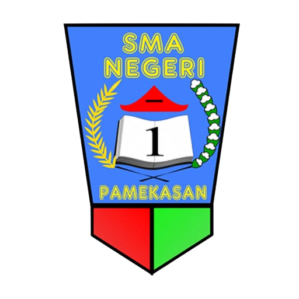
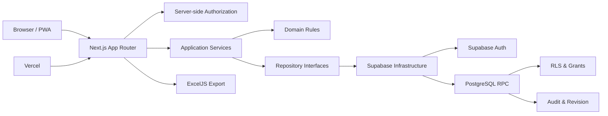
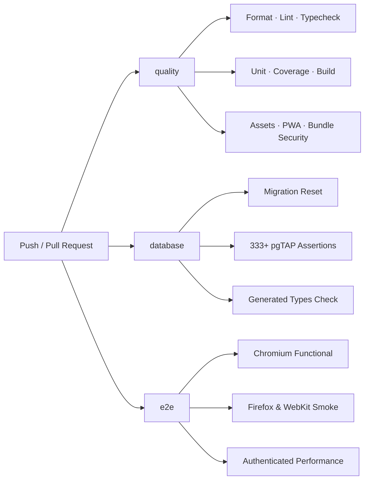
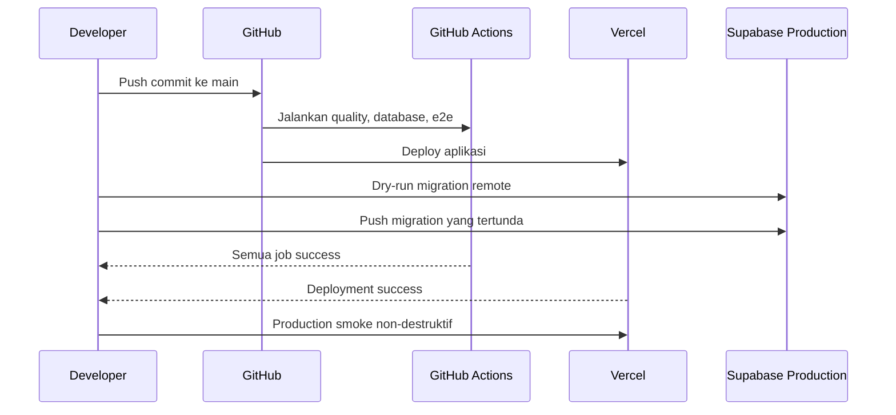

<div align="center">



<pre>
███████╗██╗██████╗ ███████╗██╗  ██╗ █████╗
██╔════╝██║██╔══██╗██╔════╝██║ ██╔╝██╔══██╗
███████╗██║██████╔╝█████╗  █████╔╝ ███████║
╚════██║██║██╔═══╝ ██╔══╝  ██╔═██╗ ██╔══██║
███████║██║██║     ███████╗██║  ██╗██║  ██║
╚══════╝╚═╝╚═╝     ╚══════╝╚═╝  ╚═╝╚═╝  ╚═╝
</pre>

### Sistem Presensi SMANSA Pamekasan

Platform operasional sekolah untuk pengelolaan siswa, presensi per jam pelajaran,<br />
laporan, import data, kenaikan tingkat, alumni, akun, dan audit.

[](https://github.com/niceswan-smansa/SIPEKA_2.0/actions/workflows/ci.yml)
[](https://www.sipekasmansa.online/)


**[Buka SIPEKA](https://www.sipekasmansa.online/)** ·
**[Dokumentasi](#dokumentasi)** ·
**[Setup lokal](#setup-lokal)** ·
**[Deployment](#deployment)**

</div>

---

## Gambaran Umum

**SIPEKA** adalah aplikasi web internal SMAN 1 Pamekasan yang menyatukan alur data siswa dan presensi dalam satu sistem yang terkontrol. Aplikasi dirancang untuk operasi harian sekolah dengan pembagian akses yang tegas, mutation transaksional, audit terpisah, dan pengujian berlapis.

> [!IMPORTANT]
> SIPEKA bersifat **online-only**. Halaman operasional, data siswa, dan API terproteksi tidak disimpan untuk penggunaan offline.

### Sekilas

|                           | Kondisi saat ini                                                         |
| ------------------------- | ------------------------------------------------------------------------ |
| **Peran pengguna**        | `USER`, `ADMIN`, `SUPER_ADMIN`                                           |
| **Struktur kelas**        | 30 slot tetap per tahun ajaran                                           |
| **Presensi**              | 10 jam pelajaran per hari                                                |
| **Status ketidakhadiran** | `IZIN`, `SAKIT`, `TANPA_KETERANGAN`                                      |
| **Identitas siswa**       | UUID internal; NIS dan NISN opsional tetapi tetap tervalidasi bila diisi |
| **Aplikasi**              | Next.js App Router di Vercel                                             |
| **Database dan Auth**     | Supabase production                                                      |
| **Quality pipeline**      | GitHub Actions, Vitest, pgTAP, Playwright, coverage, build, security     |

---

## Fitur Utama

<table>
<tr>
<td width="50%" valign="top">
<h3>👥 Siswa &amp; Kelas</h3>
<ul>
<li>Wizard pengaturan awal tahun ajaran</li>
<li>30 slot kelas tetap: X, XI, dan XII</li>
<li>Pencarian siswa dan dashboard berdasarkan kelas</li>
<li>Pembuatan, pemindahan, dan perubahan status siswa</li>
<li>NIS/NISN opsional dengan validasi dan keunikan</li>
</ul>
</td>
<td width="50%" valign="top">
<h3>🗓️ Presensi</h3>
<ul>
<li>Presensi hingga 10 jam pelajaran</li>
<li>Status per siswa dan per jam</li>
<li>Operasi bulk dan bulk Hadir</li>
<li>Preview perubahan sebelum diterapkan</li>
<li>Koreksi dengan histori revisi dan audit</li>
</ul>
</td>
</tr>
<tr>
<td width="50%" valign="top">
<h3>📊 Dashboard &amp; Laporan</h3>
<ul>
<li>Ringkasan berdasarkan tanggal dan bulan</li>
<li>Kalender presensi</li>
<li>Statistik per hari, jam, siswa, dan kelas</li>
<li>Laporan individual</li>
<li>Export workbook Excel per grade dan periode</li>
</ul>
</td>
<td width="50%" valign="top">
<h3>🔄 Siklus Akademik</h3>
<ul>
<li>Import beberapa CSV lintas kelas</li>
<li>Transaksi all-or-none</li>
<li>Kenaikan X → XI → XII → Alumni</li>
<li>Snapshot dan rollback promotion</li>
<li>Arsip serta tombstone tanpa menghapus histori</li>
</ul>
</td>
</tr>
<tr>
<td width="50%" valign="top">
<h3>🔐 Akun &amp; Akses</h3>
<ul>
<li>Login berbasis username</li>
<li>Password sementara dan wajib ganti password</li>
<li>Portal akun khusus Super Admin</li>
<li>Isolasi data operasional dari Super Admin</li>
<li>Public signup dan email recovery dinonaktifkan</li>
</ul>
</td>
<td width="50%" valign="top">
<h3>🧾 Audit &amp; Keamanan</h3>
<ul>
<li>Audit akun dan audit operasional terpisah</li>
<li>Actor selalu berasal dari session server</li>
<li>Mutation bisnis melalui RPC transaksional</li>
<li>RLS, grant, validasi database, dan bundle scan</li>
<li>Service-role key tidak boleh masuk client bundle</li>
</ul>
</td>
</tr>
</table>

---

## Batas Akses

| Area                       | USER | ADMIN | SUPER_ADMIN |
| -------------------------- | :--: | :---: | :---------: |
| Dashboard dan data siswa   | Baca | Baca  |      —      |
| Pencarian siswa dan kelas  | Baca | Baca  |      —      |
| Input dan koreksi presensi |  —   |  Ya   |      —      |
| Manajemen kelas dan siswa  |  —   |  Ya   |      —      |
| Import, promotion, alumni  |  —   |  Ya   |      —      |
| Laporan individual         | Baca | Baca  |      —      |
| Export Excel               |  —   |  Ya   |      —      |
| Portal akun dan audit akun |  —   |   —   |     Ya      |
| Audit operasional          |  —   |  Ya   |      —      |

> [!NOTE]
> `SUPER_ADMIN` mengelola akun, bukan data akademik. Pemisahan ini disengaja untuk menjaga batas kewenangan dan audit.

---

## Arsitektur



Aliran dependensi modul:

```text
Presentation ──▶ Application ──▶ Domain ◀── Repository Interface
                       │
                       └────────▶ Infrastructure Implementation
```

Prinsip utamanya:

- domain tidak bergantung pada React, Next.js, Supabase, atau browser API;
- Server Actions dan route handler tetap tipis;
- direct business write melalui Data API ditutup;
- mutation penting menggunakan RPC PostgreSQL dalam satu transaksi;
- authorization, RLS, grant, revision, dan audit saling melengkapi;
- data terproteksi tetap `network-only` dan `no-store`.

Rincian arsitektur tersedia di [`docs/architecture.md`](docs/architecture.md).

---

## Tech Stack

<div align="center">


</div>

| Lapisan              | Teknologi utama                                      |
| -------------------- | ---------------------------------------------------- |
| **Frontend**         | Next.js, React, TypeScript, Tailwind CSS             |
| **UI & visualisasi** | Shared UI primitives, Recharts                       |
| **Backend**          | Next.js Server Components, Server Actions, Route API |
| **Data & Auth**      | Supabase, PostgreSQL, Auth, RLS, RPC                 |
| **Validasi**         | Zod, constraint PostgreSQL                           |
| **Laporan**          | ExcelJS                                              |
| **Testing**          | Vitest, pgTAP, Playwright                            |
| **Delivery**         | GitHub Actions, Vercel                               |
| **Local runtime**    | Node.js 24, Docker atau rootless Podman              |

---

## Struktur Proyek

```text
SIPEKA_2.0/
├── src/
│   ├── app/                    # Route, layout, API, dan composition
│   ├── modules/                # Modul bisnis per fitur
│   │   └── <feature>/
│   │       ├── domain/
│   │       ├── application/
│   │       ├── infrastructure/
│   │       ├── presentation/
│   │       └── tests/
│   ├── shared/                 # UI, security, constants, dan utilitas lintas fitur
│   └── infrastructure/         # Adapter teknis lintas fitur
├── supabase/
│   ├── migrations/             # Schema dan RPC berurutan
│   ├── tests/                  # pgTAP constraints dan RLS
│   └── seed.sql                # Data sintetis lokal
├── e2e/                        # Chromium, Firefox, WebKit, performance
├── tools/                      # Quality, migration, bootstrap, dan smoke scripts
├── public/                     # Brand assets, manifest, service worker
└── docs/                       # ADR, arsitektur, testing, runbook
```

---

## Setup Lokal

### Prasyarat

- Node.js `24.x`
- npm
- Docker atau rootless Podman
- Supabase CLI melalui dependency project

### Mulai

```bash
git clone https://github.com/niceswan-smansa/SIPEKA_2.0.git
cd SIPEKA_2.0

npm ci
cp .env.example .env.local

npm run db:start
npm run db:reset
npm run seed:test-users
npm run dev:local
```

Aplikasi lokal tersedia sesuai alamat yang ditampilkan oleh runner development.

> [!CAUTION]
> Jangan pernah menyalin credential, service-role key, dump, atau data siswa production ke repository maupun environment lokal. Fixture pengujian wajib sintetis.

<details>
<summary><strong>Perintah database lokal</strong></summary>

```bash
npm run db:start
npm run db:reset
npm run db:types
npm run db:types:check
npm run test:db
npm run db:stop
```

`db:reset` hanya untuk database lokal/disposable. Jangan mengarahkannya ke database remote.

</details>

---

## Quality Gates

Pipeline CI dibagi menjadi tiga kelompok:



Perintah utama:

```bash
npm run test:dependency-policy
npm run format
npm run lint
npm run typecheck
npm run test
npm run test:coverage
npm run test:migration-policy
npm run test:assets
npm run test:pwa
npm run test:db
npm run db:types:check
npm run test:auth-policy
npm run test:e2e
npm run test:e2e:cross-browser
npm run test:performance
npm run build
npm run test:bundle
```

> [!WARNING]
> `test:e2e` tidak mereset database. `test:e2e:reset` hanya boleh dijalankan pada database localhost disposable dengan flag dan sentinel yang diwajibkan.

Selengkapnya: [`docs/testing.md`](docs/testing.md).

---

## Import Data

Template CSV operasional:

```csv
NIS,NISN,NAMA,JENIS_KELAMIN
10001,0091234567,Nabila Putri,P
,,Siswa Tanpa Identifier,L
```

Ketentuan utama:

- NIS dan NISN boleh kosong;
- identifier yang diisi harus valid dan unik;
- nama dan jenis kelamin wajib valid;
- import beberapa file/kelas dilakukan secara all-or-none;
- payload invalid membatalkan seluruh transaksi;
- workbook/data lama hanya diproses melalui dry-run redacted.

Dry-run data lama:

```bash
npm run migration:dry-run
```

Output summary disimpan di `.local/migration-dry-run.json` dan tidak boleh memuat PII mentah.

---

## Deployment



### Aplikasi

Push ke `main` memicu GitHub Actions dan deployment Vercel.

### Database production

Migration database production **tidak otomatis diterapkan oleh deploy Vercel**. Sebelum push migration:

```bash
SUPABASE_TELEMETRY_DISABLED=1 DO_NOT_TRACK=1 \
npx supabase migration list --linked

SUPABASE_TELEMETRY_DISABLED=1 DO_NOT_TRACK=1 \
npx supabase db push --linked --dry-run
```

Setelah target dan daftar migration terverifikasi:

```bash
SUPABASE_TELEMETRY_DISABLED=1 DO_NOT_TRACK=1 \
npx supabase db push --linked
```

Verifikasi ulang:

```bash
SUPABASE_TELEMETRY_DISABLED=1 DO_NOT_TRACK=1 \
npx supabase migration list --linked
```

> [!CAUTION]
> Jangan gunakan `db reset --linked`, jangan sertakan seed production, dan jangan menjalankan destructive E2E atau load test terhadap production.

### Smoke production

```bash
SMOKE_BASE_URL=https://www.sipekasmansa.online \
npm run smoke:production
```

Build berhasil saja belum cukup. Release dianggap sehat setelah CI, migration production, Vercel, dan smoke non-destruktif terverifikasi.

---

## Prinsip Keamanan

- Public signup dan recovery email tidak tersedia.
- Username adalah identity aplikasi; synthetic Auth identity tidak ditampilkan.
- Credential sementara tidak disimpan di source, migration, atau audit.
- Service-role key hanya berada pada server boundary.
- Client bundle dipindai terhadap service-role dan marker identity.
- Mutation bisnis menggunakan RPC transaksional dengan actor dari session.
- Direct business write melalui Data API ditutup.
- RLS dan grant membatasi read/execute berdasarkan role.
- Audit akun dan audit operasional terisolasi.
- Protected route, API response, dan PII tetap `no-store`.
- Dependency policy menolak high/critical yang tidak memiliki mitigasi terverifikasi.

Rincian dependency: [`docs/dependency-security.md`](docs/dependency-security.md).

---

## Dokumentasi

| Dokumen                                                        | Isi                                   |
| -------------------------------------------------------------- | ------------------------------------- |
| [`docs/architecture.md`](docs/architecture.md)                 | Boundary modul dan aliran dependensi  |
| [`docs/development.md`](docs/development.md)                   | Setup dan workflow development        |
| [`docs/testing.md`](docs/testing.md)                           | Matriks pengujian dan debugging       |
| [`docs/production-readiness.md`](docs/production-readiness.md) | Deployment, UAT, backup, dan incident |
| [`docs/runbook.md`](docs/runbook.md)                           | Operasi, recovery, dan diagnosis      |
| [`docs/adr/`](docs/adr/)                                       | Architecture Decision Records         |

---

## Status Proyek

- **Production:** aktif di [sipekasmansa.online](https://www.sipekasmansa.online/)
- **Database:** Supabase production
- **Delivery:** branch `main` → GitHub Actions → Vercel
- **Mode:** aplikasi internal sekolah, repository private
- **Data test:** sintetis
- **Offline:** fallback informatif saja; operasi memerlukan koneksi

---

<div align="center">

### SIPEKA

**Sistem Presensi SMANSA Pamekasan**

Dibangun untuk alur operasional sekolah yang aman, dapat diaudit, dan teruji.

</div>
